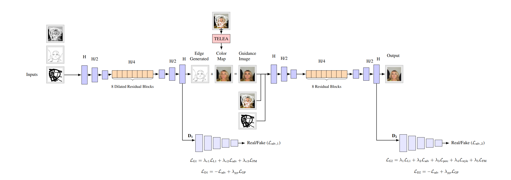
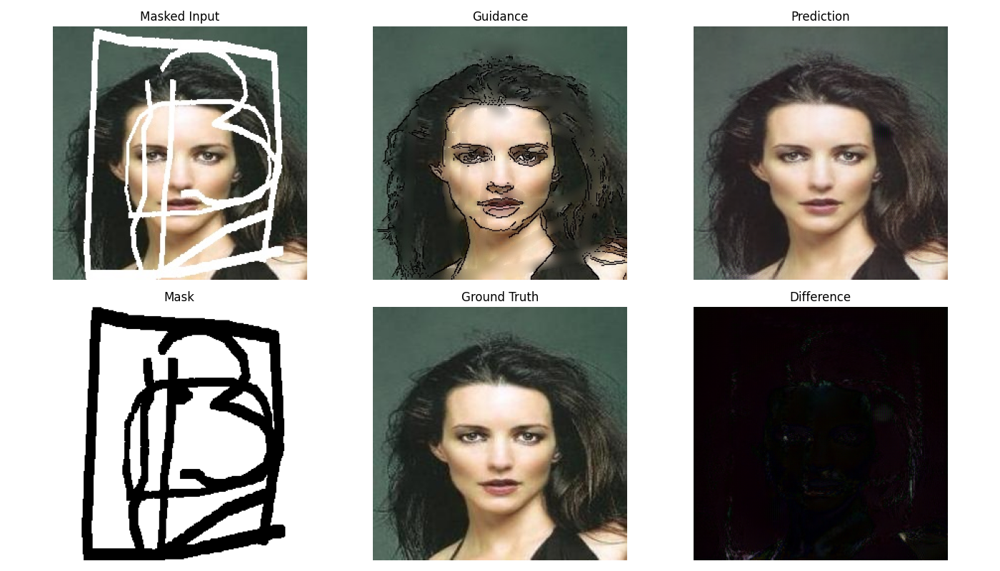

# EdgeConnect+: Adversarial Inpainting with Edge and Color Guidance

EdgeConnect+ is a deep learning-based image inpainting framework that enhances the original [EdgeConnect](https://arxiv.org/abs/1901.00212) model. This project integrates both **edge structure** and **color guidance** to produce perceptually realistic reconstructions of masked images.

📄 [Final Paper (PDF)](EdgeConnectplus_Adversarial_Inpainting_with_Edge_and_Color_Guidance.pdf) 

---

## 🧠 Overview

The model is divided into a three-stage pipeline:

1. **Edge Generation (G1)**: Predicts edges in masked regions using grayscale input and binary masks. 
2. **Color Guidance**: Provides low-frequency chromatic information from the unmasked image regions and blends it with predicted edges to guide final image inpainting.
3. **Final Inpainting (G2)**: Synthesizes the completed image using combined structure and color guidance.

---

## 🧱 Model Architecture

Below is the complete architecture diagram showing the flow from input to final output:



---

## 📁 Project Structure

```
.
├── config.py                  # Global configuration
├── train.py                   # Main entry point
├── dataloader_g1.py           # Dataloader for G1
├── dataloader_g2.py           # Dataloader for G2
├── g1_model.py                # Generator and Discriminator for G1
├── g2_model.py                # Generator and Discriminator for G2
├── loss_functions.py          # All loss definitions (L1, Adv, FM, Perceptual, Style)
├── train_loops_g1.py          # Training loop for G1
├── train_loops_g2.py          # Training loop for G2
├── utils_dl.py                # Dataset utilities
├── utils_g1.py                # Utilities for training G1 (saving, evaluation, etc.)
├── utils_g2.py                # Utilities for training G2
├── find_lr.py                 # Learning rate finder
├── demo.py                    # Inference script for testing / demo
├── evaluate_models.py         # Computes evaluation metrics (PSNR, SSIM, L1, LPIPS, FID)
├── requirements.txt           # Python dependencies
└── README.md                  # This file
```

---

## 🧪 Datasets

- **CelebA Dataset**: All images are center-cropped and resized to 256×256.
- Irregular binary masks generated with ≥ 20% coverage.
- Masks applied during preprocessing to create white-hole inputs.
- Ground truth edges from Canny on original images.
- Input edges computed from masked image with mask-edges removed.

---

## ⚙️ Training Setup

- Batch Size: 192  
- Epochs: 25 (G1), 5 (G2)
- Optimizer: Adam (lr = 1e-4, weight_decay = 5e-5, β₁ = 0.0, β₂ = 0.9)  
- Architecture: ~21.5M parameters across G1 and G2  
- Precision: Mixed Precision (AMP) with Gradient Scaling  
- Stabilization: Exponential Moving Average (EMA) on generator weights  
- Early Stopping: Stops after 5 epochs without validation improvement  
- Checkpointing: Periodic, resume-safe; sample outputs saved every 200 batches  
- Tuning: Supports live loss-weight adjustment during training  
- Hardware: Trained on CUDA-enabled NVIDIA A100 GPUs  

---

## 🚀 Getting Started

Follow the steps below to set up and run the EdgeConnect+ inpainting pipeline:


### 1️⃣ Clone the Repository

```
git clone https://github.com/Abhinaykotla/EdgeConnect_Plus_Inpainting_with_Edge_and_Color_Guidance.git

cd EdgeConnect_Plus_Inpainting_with_Edge_and_Color_Guidance
```

### 2️⃣ Install Dependencies

We recommend using Python ≥ 3.8 and a virtual environment.

```
pip install -r requirements.txt
```

### 3️⃣ Prepare the Data

Organize your image data and masks into the following folder structure:

```
data_archive/
└── CelebA/
  ├── train_input/ # masked images
  ├── train_gt/ # original ground truth images
  ├── val_input/
  ├── val_gt/
  ├── test_input/
  └── test_gt/
```
Input images can be created using random masks with the help of notebooks\celeba_data_prep.ipynb

Ensure that:
- All images are 256×256 `.jpg` files
- Masked images use white (255,255,255) pixels for missing regions


### 4️⃣ Start Training (G1 + G2)

```
python train.py
```

- Trains the full pipeline:  
  - G1 (Edge Generator) + D1 (Discriminator)  
  - G2 (Inpainting Generator) + D2 (Discriminator)  
- Inputs:
  - For G1: grayscale image, canny edge map, binary mask  
  - For G2: masked RGB image, color guidance (edge + color), binary mask  
- Outputs:
  - From G1: Edge maps
  - From G2: Final inpainted RGB images
  - Checkpoints, loss curves, sample visualizations in the `models/` folder

To resume training from checkpoints, simply re-run the same command.

### 5️⃣ Run Inference / Testing

To test the trained model on new inputs:

```
python demo.py
```

Make sure your test input folder is properly set in `config.py`. The script will:
- Load the latest checkpoints
- Generate color guidance
- Save final inpainted results to `output/` or `models/generated_samples_g2/`

### 6️⃣ Evaluate Results (Optional)

To compute PSNR, SSIM, L1, LPIPS and FID:

```
python evaluate_models.py
```

You can customize evaluation parameters and paths in `config.py`.
 
---

## 🧪 Evaluation Metrics

| Metric       | EdgeConnect | EdgeConnect+ (Ours) |
|--------------|-------------|---------------------|
| **PSNR**     | 25.28       | 25.23               |
| **SSIM**     | 0.846       | 0.864               |
| **L1 Loss**  | 3.03%       | 4.83%               |
| **FID**      | 2.82        | 2.94                |
| **LPIPS**    | —           | 0.193               |

While PSNR and L1 are slightly lower due to perceptual prioritization, EdgeConnect+ demonstrates **stronger structure preservation and realism** in challenging regions.

---

## 📷 Sample Output


  - Top: Masked input, color guidance, final output  
  - Bottom: Binary mask, ground truth, absolute error map

The difference map, which is largely dark, indicates high alignment between prediction and ground truth,
demonstrating the potential of the model for high-quality
image reconstruction.

---

## 📐 Loss Formulations

### Generator Losses

**Edge Generator (G1)** uses:
L_G1 = λ₁ * L1 + λ₂ * Adversarial + λ₃ * FeatureMatching

**Inpainting Generator (G2)** uses:
L_G2 = λ₁ * L1 + λ₂ * Adversarial + λ₃ * Perceptual + λ₄ * Style + λ₅ * FeatureMatching

Each term captures a different property:  
- **L1**: pixel-wise accuracy  
- **Adversarial**: realism through PatchGAN  
- **Perceptual, Style**: high-level consistency via pretrained VGG  
- **Feature Matching**: stabilizes GAN training

### Discriminator Losses

To enforce discriminator regularization and improve GAN stability, **Gradient Penalty (GP)** is added to both D1 and D2.

**Final Discriminator Loss**:
L_D = −L_adv + λ_gp * L_GP

---

## 🔭 Future Work

EdgeConnect+ lays the groundwork for a powerful dual-guided inpainting framework, and several promising directions remain open for enhancement:

- **Extended Training and Scaling**: With additional computational resources, longer training of the inpainting stage (G2) can unlock finer textures, stronger semantic alignment, and improved generalization.
- **Semantic Conditioning**: Incorporating high-level priors (e.g., segmentation, vision-language models) may enable controllable inpainting.
- **Learnable Fusion**: Replacing fixed guidance overlays with attention-based or adaptive fusion could enhance flexibility.
- **Dataset Generalization**: The modular design can extend beyond facial data to natural scenes, bodies, and text-rich contexts.
- **End-to-End Color Guidance**: Learning color priors instead of handcrafting them may yield more expressive, trainable inputs.

---

## 🤝 Contributors

- **Abhinay Kotla** — [@abhinaykotla](https://github.com/Abhinaykotla)  
- **Sanjana Ravi Prakash** — [@sanjanarp](https://github.com/sanjanarp)

---

## 🧠 Citation

```
@misc{edgeconnectplus2025,
  author = {Abhinay Kotla and Sanjana Ravi Prakash},
  title = {EdgeConnect+: Adversarial Inpainting with Edge and Color Guidance},
  year = {2025},
  note = {University of Texas at Arlington, CSE 6367}
}
```

---

## 📄 License

This repository is shared for educational and research purposes.

---

## 📬 Acknowledgements

- [EdgeConnect (Nazeri et al.)](https://arxiv.org/abs/1901.00212)
- [CelebA Dataset](http://mmlab.ie.cuhk.edu.hk/projects/CelebA.html)

---
